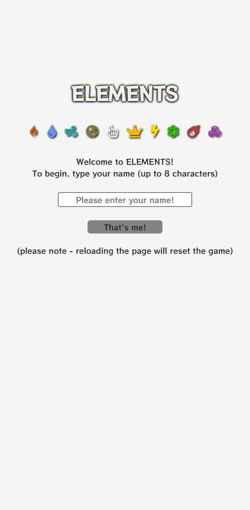

# **ELEMENTS**

*Elements* is a simple yet alluring mobile clicker game that is best described as interactive art with a finite play experience... and achievements!

The project was developed by [Jamie McKenzie](https://github.com/JamieM-Hub) as part of the [Full Stack Software Development](https://codeinstitute.net) diploma at Code Institute.

Click [here](http://https://jamiem-hub.github.io/JM-Idle-Game/) to check it out!

# UX

*Elements* is a primitive clicker game with no automation, prestige system or player abilities.

In the design process of a clicker game, it was significant that the game mechanics available to keep Users engaged are minimal. For this reason, major developmental focus was placed on the game's aesthetic and general immersion. The aesthetic was designed to be bold and colourful in every corner, with unlockable themes rewarding continued gameplay.

In addition to aesthetic, I used subtle humour as an additional tool to maintain User engagement. This is featured as text alongside unlocked achievements.

## Wireframes

Simplicity was also a key factor in the design process. Everything the User needs is accessible from index.html, including modals and toggler divs containing menus and content.

Because the shape of the *Elements* game board is fairly square, I decided it would be best to replicate the same layout on both landscape and portrait orientations for consistency, accepting a possible limitation on the amount of content I can display on the landscape orientation.

I wanted a single design that works on portrait for all screen sizes and a slightly adapted version that works on landscape for all screen sizes to allow as much content to fit as possible.

Whilst I did keep the design mostly the same, due to spatial issues I moved the menu to cover the game title when activated.

## User Stories
Clicker games are very popular on the mobile market, which is highly saturated.

For this project I wanted to create something that would catch a potential User's eye and give a satisfying play experience to a game genre that is often criticised for it's lack of complex gamplay.

Although *Elements* is fully responsive for all breakpoints, the game was designed to be played on a smartphone or tablet as this is the target market.

The following are some examples of typical mobile game consumers:
- As a busy User looking for a quick distraction
    - I want something I can easily jump into
    - I want something that will keep me entertained for a short period of time
    - I want something simple that doesn't require complex thought
- As a User looking for a game with progression and reward
    - I want clearly defined objectives
    - I want to be rewarded for clearing goals with something I can use
    - I want to feel a sense of improvement as I continue playing
- As a User who is a fan of clicker-style games
    - I want an aesthetically pleasing experience
    - I want a robust product of high quality
    - I want to experience something that stands out within a saturated market

# Features
### Player Name
- Users enter their name before playing.
- The User's name is displayed on screen alongside their score and number of clicks.
### Levelling Up
- Each Element has a level that can be increased by clicking the Element enough times.
- Reaching certain levels unlocks bonuses.
### Upgrades
- Each Element can be upgraded up to three times, adding a count multiplier each time.
- Upgrade multipliers are displayed within the clicker buttons.
### Theme Change
- 10 styling schemes unique to each of the 8 Elements (plus the default theme and a bonus theme) are selectable.
- Themes are unlocked as rewards for completing an Element.
### Achievements
- Unlockable achievements that appear on screen when unlocked
- Each includes a unique unlock message viewable in the Achievements menu.

## If I Had Time
Given unlimited time, the following features would be included in the final product:
- Unique sound effects and background music for each theme
- A progress bar alongside or instead of numerical counters
- An unlockable automation upgrade
- The option to retain unlocked Themes when starting a New Game
- Additional animations and interactivity to make the game pop
- JSON serialization to prevent page reload resetting the game

# Technologies Used
## Languages
### HTML *(49.7%)*

A large number of small HTML elements like buttons and bootstrap grids have resulted in a larger than expected HTML file.

### JavaScript / jQuery  *(38.2%)*
    
jQuery was the operational focus of this project alongside the Bootstrap grid, and many styling operations are done in jQuery instead of CSS.

### CSS *(12.1%)*

As above, much styling was done in jQuery however all media queries were coded in CSS.

## Libraries
- Bootstrap
- jQuery
- Font Awesome
- Google Fonts

# Testing
## Functional Testing
### Input fields
There is only one User input in *Elements*, which is name entry before the game begins. When the User starts a New Game, they are prompted for their name again before restarting the game.

The following values were tested on both inputs:
- Null (nothing was typed in)
    - Input text was deleted and input placeholder asked User to enter their name
- More than 8 characters
    - Character entry is disabled after 8 characters
- Between 1 and 8 characters
    - Entry accepted and game screen loads
- Bugs
    - Maximum length working correctly in browser, but using the same browser on a real smartphone allows limitless character entry
        - Function created to catch the error, delete the text input and pass a message to the user via the placeholder
        - Input validation missing from new game function
        - Adding code fixed bug

### Menu toggling
The icons in the top left and top right corners toggle one of two menus - the main menu and the Theme menu. Each menu occupies the same space in front of the game title and needs to be closed before opening the other menu if that icon is clicked.

- When neither menu was active:
    - The Theme button activated the Themes menu
    - The main menu button activated the main menu
- When the Themes menu was active:
    - The Theme button deactivated the Themes menu
    - The main menu button deactivated the Themes menu and activated the main menu
- When the main menu was active:
    - The Theme button deactivated the main menu and activated the Themes menu
    - The main menu button deactivated the main menu
### Themes
Each Theme button was tested when in a locked and unlocked state.
- When locked, Theme buttons do nothing when clicked
- When unlocked, Theme buttons change all relevant elements to the selected Theme when clicked
- Each theme's palette and background image is relevant to the theme
- Each background image displays correctly in both orientations at all reolutions
### Game menu buttons
- Each button activates its own modal when clicked
### Clicker buttons
Each Element's clicker button displays the Element's level, current click count, clicks to next level, and upgrade multiplier if unlocked. The total clicks for each Element are displayed underneath on the tracker table.

To ensure the script is performing mathematical operations correctly, I did the following:
- Checked count and total count incremented every time I clicked the button
- Checked count and total count increment matches increment displayed on tracker
- Checked count on clicker was not affected by level up function
- Checked count and total count's increment increased when upgrade unlocked
- Tested clicking button after Element completed - disabled
### Achievement buttons
- Tested each achievement button, all of which show the achievements modal
- Achievement buttons are not clickable if not unlocked
## Script Testing
### Checking Tools
#### *index.html ran through [https://validator.w3.org/](https://validator.w3.org/)*
- Theme and main menu buttons aria-labelledby attributes illegal and do not have a role attribute
    - removed attributes without affecting performance
    - added role attributes
- Achievement buttons ilegally wrapped in `<a>` tags
    - changed to `
` tags
- 24 `<button>` elements with illegal `
` tag children
    - unable to change without breaking display
    - tags left unchanged as the error does not affect performance
#### *style.css ran through [https://jigsaw.w3.org/css-validator](https://jigsaw.w3.org/css-validator)*
- 4 invalid attribute values
    - all removed, no affect on performance
#### *script.js ran through [https://jshint.com/](https://jshint.com/)*
- Lines missing semicolons (warning only)
    - I decided not to use semicolons in script.js as the code is already quite busy

### Debug Mode
I designed a Debug Mode to allow streamlined testing of things like unlocking achievements or levelling up, which require time to perform. Debug Mode was also useful to test responsiveness when all game board elements are displayed, and refine Themes.

Debug Mode includes the following operations:
- Unlock and display all Elements' clicker buttons
- Unlock and display all Achievements on game board and in menu
- Change to any selected Theme

A secondary Debug Mode to reduce the number of clicks needed to level up on one Element to 1 was used to quickly test the Theme unlock function, which would otherwise require hundreds of clicks to unlock one Theme.
## UX Testing
### Breakpoints
After adding media queries, *Elements* was tested on portrait and landscape orientation  and found satisfactory for all breakpoints, and for the following device templates on Developer Tools:
- Moto G4
- Galaxy S5
- Pixel 2
- Pixel 2 XL
- iPhone 5/SE
- iPhone 6/7/8
- iPhone 6/7/8 Plus
- iPhone X
- iPad
- iPad Pro

### Bugs
Whilst testing the UX I noticed that it was impossible to unlock one of the achievements (Secret 1: Devil's Game - score 666) as after the first Element reaches level 3, the total score is odd, and every click on any button after that will be even due to the maths system.

A permanent fix would have taken too much time to implement as this would require changing the entire maths system to accommodate odd numbers. Instead I changed the achievement to "almost" getting a score of 666, which will unlock when the User scores 665 or 667.

On the very final test I noticed that the tracker count would not reduce as it should when leveling up, which was fixed in subsequent commits.

### User Stories
- As a busy User looking for a quick distraction,
    - I want something I can easily jump into
        - When the game started I was welcomed to the game and prompted to enter my name to begin. Upon doing this the main game was loaded and I could begin clicking immediately.

            
            
            

    - I want something that will keep me entertained for a short period of time
        - I clicked the Fire Element to see how far it would go up. It capped at 10 and I was awarded a theme. I repeated this with all other Elements and was awarded the final theme for doing so. The whole process took about 8 minutes of continuous clicking.

            
            
            

    - I want something simple that doesn't require complex thought
        - I leveled up and unlocked upgrades and themes, and the only action I performed was clicking buttons, changing themes, and checking the achievement menu when unlocked. I also looked at the developer tab and tried starting a new game once I had completed the game. After this there was nothing else to do.

            
            
            

- As a User looking for a game with progression and reward,
    - I want clearly defined objectives
        - I entered my name and started the game. I was given one button to click. On clicking, a table appeared displaying information about the button. On the button was displayed "Level 1" and underneath "UNLOCK!". I continued clicking and noticed the number go up. When the target was reached, the level increased and "LEVEL UP!" was displayed. On reaching level 3 I unlocked a multiplier which was displayed on the button and the increment on the table increased. At some point another button appeared which reacted just like the first one and could be leveled and completed. This process repeated until the game was complete.

            
            
            

    - I want to be rewarded for clearing goals with something I can use
        - I entered my name and started clicking on the Fire Element. When I got to level 3, I unlocked an upgrade which was immediately activated and the Element increment increased accordingly. The same thing happened at level 5 and 7. On reaching level 10, I received a theme for the Element I completed, which activated a button to access the themes menu. I clicked the Fire button and the theme changed immediately. On completing all elements I was rewarded with the final theme which I could select immediately.

        
        
        

    - I want to feel a sense of improvement as I continue playing
        - I entered my name and started clicking the Fire button. When I got to level 3 I unlocked a x2 upgrade. Each click now added 2 to the count. At level 5 I unlocked a x3 upgrade. Each click now added 6 to the count. At level 7 I unlocked a x5 multiplier. Each click now added 30 to the count. At level 10 I unlocked the Fire theme which I could select straight away. I clicked the Water element which started with an increment of +2. The upgrade pattern was the same all the way up to level 10. Each Element unlocked had double the previous Element's starting increment, and the count required to level increases for each new Element.

        
        
        

- As a User who is a fan of clicker-style games,
    - I want an aesthetically pleasing experience
        - When the game began the style was minimal but colourful with many different icons representing elements displayed. I entered my name, continued and the main game appeared. It had a high resolution background of a grey building with stairs, and the colour scheme matched the image. I continued to play the game and eventually unlocked the Earth theme. The background changed to a forest scene and the colour scheme changed to match the image. As I completed the other elements and tried the other themes this pattern was consistent. The themes menu icons matched their own colour scheme rather than the currently selected theme.

        
        
        

    - I want a robust product of high quality
        - When the game began I clicked the "That's Me!" button and a message was displayed in the text box asking me to enter my name. I tried to enter more than 8 characters but I could not enter more than 8. I entered my name and started the game. Each button worked and as I played, the numbers displayed on the table and on the button were consistent, including the multipliers. The menu button brought up 3 buttons which each activated a different modal. I clicked Fire until level 10 which completed the Element, unlocked a theme and disabled the button. The themes menu button brought up 10 buttons. The unlocked themes changed the theme when clicked, and the others were disabled. As I unlocked themes the button changed colour and now changed theme when clicked. Upon completing the game I tried starting a new game which prompted me to enter my name to continue. I tested the input as the first and the result was the same.

        
        
        

    - I want to experience something that stands out within a very saturated market
        - When I started the game the theme was clear and the design was minimal. I entered my name and an image was loaded with a button. When I clicked the button a table appeared with a leveling system. Leveling unlocked upgrade multiplier upgrades and when the element was completed, it stopped being clickable. Themes based on the elements were unlocked and could be changed from a menu. An achievement appeared whilst I was clicking. On the achievement menu this was unlocked because I almost had score of 666.

        
        
        

## Player Testing
*Elements* was human tested with a few individuals who were asked to play and complete *Elements*, then answer the following questions:

1. What contributed to a positive experience?
2. What contributed to a negative experience?
3. Did you encounter anything strange or unusual?
4. What additional features would improve the experience?
5. On a scale of 1-10, how would you rate *Elements*?
6. Any additional comments?

Most respondents gave generally positive feedback but did not go into much detail. Therefore I've only included one set of answers from a User who provided useful suggestions. For legal reasons, his real name has not been used.

### Josh's experience
#### *What contributed to a positive experience?*
- progressive nature
- surprise bonuses at random new levels
- table at the bottom that shows score/level/points per click
- achievements is a good idea
- unlockable backgrounds
#### *What contributed to a negative experience?*
- duplication of elemental score on its box AND the table wasn't for me
- backgrounds were static but also slightly busy and distracting
#### *Did you encounter anything strange or unusual?*
- no music/sound effects that i could hear
- no bonus points for calling yourself Jamie
#### *What additional features would improve the experience?*
- having a highlight option or something to denote which achievement has just been unlocked, or possibly just showing the achievements in order of being unlocked so you can easily see which one you have just unlocked
- achievement buttons on the bottom should be coloured, and the click ones especially should be differentiated
- maybe some form of XP bar to show level progression? or possibly a worded prompt to denote how close you are to next level/achievement
- some kind of notification when new level/achievement is done
#### *On a scale of 1-10, how would you rate Elements?*
- 7/10
#### *Any additional comments*
- No

### Follow up
Many of Josh's suggestions I had already considered in the *If I Had Time* section of this document, such as sound effects and progress bars.

I was able to implement one of Josh's suggestions - coloured Achievevement buttons. The reason I decided to change this so late in development is because it was originally this way (I removed the colour when refining the design) and I'd considered re-implementing the colour a few times. I think this was a good design choice and I'm glad the suggestion was made.

# Deployment

You can deploy this project to GitHub by doing the following:

1. Log in to your GitHub account and search for/locate this repository
2. Click the 'Settings'button at the top of the page
3. Find the 'GitHub Pages' section
4. Make sure 'main' is selected on the 'Branch' dropdown
5. Click the newly-created link with a green tick next to it.
6. Enjoy the website!

## Forking the GitHub Repository
You can fork this GitHub Repository if you wish to make a copy of the original repository on your GitHub account without affecting the original respository:

1. Log in to your GitHub account and search for/locate this repository
2. Click the 'Fork' button at the top of the page
3. Your GitHub account will now have an exact copy of the project that you can edit

## Making a Local Clone
1. Log in to your GitHub account and search for/locate this repository
2. Click the 'Code' dropdown and select your cloning method
3. If you have GitHub Desktop, click the GitHub Desktop button
    * The application will open with this repository available for editing
4. If you're using an alternative Git service
    1. Open Git Bash
    2. Make sure the current working directory is set to the location where you want to place the clone.
    3. Type 'git clone' in your command line and paste the URL given on the GitHub repository page

*Elements* was deployed via GitHub Pages at [GitHub.com](https://GitHub.com). At the time of writing, the development and deployment versions of *Elements* are identical.

If you'd like to run *Elements* locally, clone the repo from the menu above and open *index.html* in your web browser.

# Credits
## Resources
- Firefox Developer Tools
- Stack Overflow
- w3schools
- MSN Web Docs

## Digital Copyright
- All background images obtained free from [Unsplash](https://unsplash.com) and [Pexels](https://pexels.com)
- All icons obtained free from [Font Awesome](https://font-awesome.com)

## Acknowledgements
- This project was inspired by mobile idle/clicker games
- Thank you to my mentor Aaron for your continued help and advice
- Thank you to Josh and those who were kind enough to play test *Elements* and provide feedback

# Message From Developer

*Elements* is the first project I have ever published that can be considered a video game.

My software development journey has always had games design as it's destination, and this is a huge milestone for my career.

Thank you for reading this message and I hope you enjoy *Elements*!